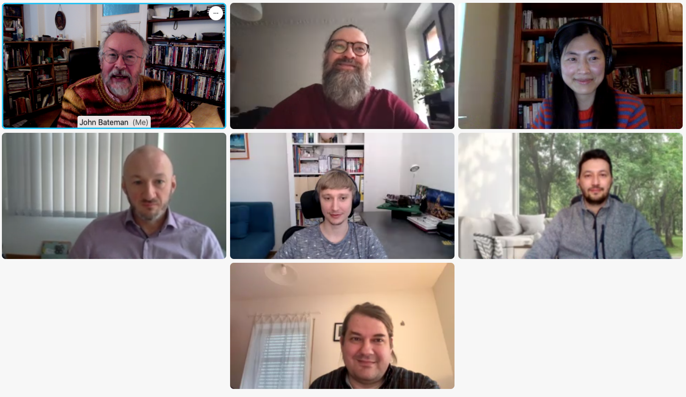

 

 

<h1>FakeNarratives - Understanding Narratives of Disinformation in Public and Alternative News Videos</h1>

This is the official webpage of the joint FakeNarratives research project. Check out the <a href="https://fakenarratives.github.io/about/" style="color:black"><i>project description</i></a>, project partners (<a href="https://fakenarratives.github.io/bre" style="color:black"><i>University of Bremen</i></a>, <a href="https://fakenarratives.github.io/l3s" style="color:black"><i>L3S Research Center</i></a>, <a href="https://fakenarratives.github.io/lpz" style="color:black"><i>University of Leipzig</i></a>). We will update the page with news, resources, publications.

 
 

<h2>Recent Updates </h2>

	
	

	The first project meeting took place virtually on February 1, 2022.
	

